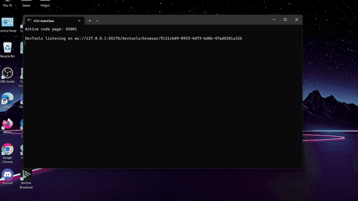
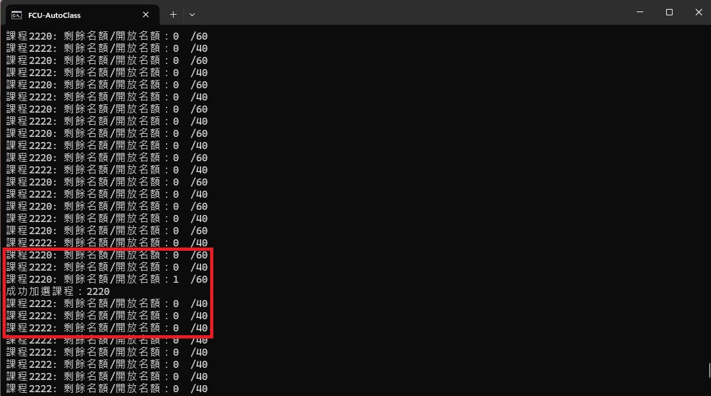

<div align="center">
  <h1 id="逢甲大學自動搶課機器人">
    <a href="https://github.com/HappyGroupHub/FCU-AutoClass" target="_blank">逢甲大學 - 自動搶課機器人</a>
  </h1>

[](https://github.com/HappyGroupHub/FCU-AutoClass/releases)
[](https://github.com/HappyGroupHub/FCU-AutoClass/releases)
[](https://github.com/HappyGroupHub/FCU-AutoClass/blob/master/LICENSE)

</div>


## 介紹

### [ 2024/8/28 - 實測加選成功! ]
這個程式可以協助你在逢甲大學的選課系統中，無時無刻追蹤你想要的課程，當有任何人退選時，自動幫你搶課加選。

目前支援: 多課程加選、無視窗加選、出錯自動重啟




## 使用方法

1. 從 [這裡](https://github.com/HappyGroupHub/FCU-AutoClass/releases) 下載最新的版本的程式
2. 解壓縮檔案後會生成一個資料夾
3. 打開 `config.yml` 並完成填寫裡面的資料 (詳細說明請看下面介紹)
4. 開啟 `run.bat` 後就完成了!

## 關於 config.yml

```yaml
# ++--------------------------------++
# | FCU-AutoClass                    |
# | Made by LD (MIT License)         |
# ++--------------------------------++

# FCU Account
username: ''
password: ''

# Class to join
# If you have more than one class to join, please separate them with space.
# Example: class_id: '0001 0002'
# The less class_id you have, the more rate you can get the class you want.
class_id: ''

# Headless mode
# If you want to run this script in headless mode, please set this to true.
headless: false
```

* `username`: 請填入你的學號(帳號)
* `password`: 請填入你的選課系統密碼
* `class_id`: 請填入你想要加選的課程代碼，如果有多個課程請用空格隔開 (例如: `'0001 0002'`)
* `headless`: 如果你想要讓程式在背景執行，請填入 `true`，否則請填入 `false`

## 遇到任何問題嗎?

如果你在使用上面有遇到任何問題或bug，甚至是有建議想提出，請到 [這裡](https://github.com/HappyGroupHub/FCU-AutoClass/issues)
提出你的想法!

程式遇到 Bug 要提交問題的時候，歡迎附上資料夾內 `FCU-AutoCLass > logs > xxx.txt` 最新的紀錄檔，方便我做除錯。

## 版權

此專案的版權規範採用 **MIT License** - 至 [LICENSE](LICENSE) 查看更多相關聲明